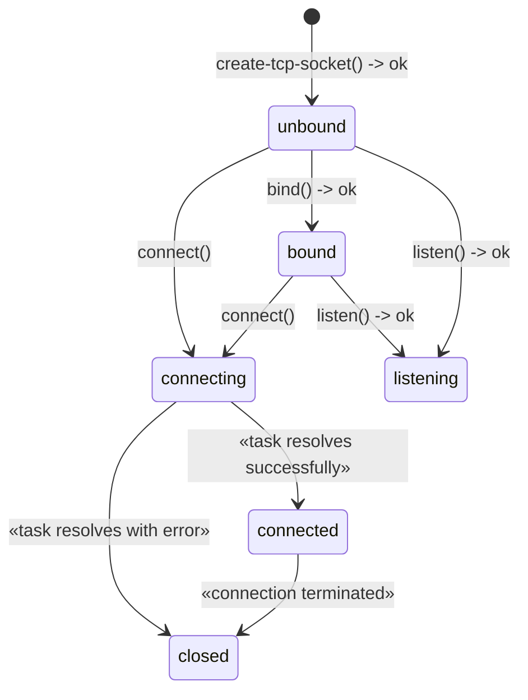

# Operational semantics of WASI TCP sockets

WASI TCP sockets must behave [as-if](https://en.wikipedia.org/wiki/As-if_rule) they are implemented using the state machine described in this document.

## States
> Note: These refer to the states of the TCP socket, not the [TCP connection](https://datatracker.ietf.org/doc/html/rfc9293#name-state-machine-overview)

In pseudo code:

```wit
interface tcp {
    variant state {
        unbound,
        bound,
        listening(accept-stream),
        connecting(connect-future),
        connected,
        closed(option<error-code>),
    }
}
```

## Transitions
The following diagram describes the exhaustive set of all possible state transitions:



- Transitions annotated with `-> ok` only apply when the method returns successfully.
- Calling a method from the wrong state returns `error(invalid-state)` and does not affect the state of the socket.
- This diagram only includes the methods that impact the socket's state. For an overview of all methods and their required states, see [tcp.wit](./wit/tcp.wit)
- Client sockets returned by `listen()` are immediately in the `connected` state.
- A socket resource can be dropped in any state.
