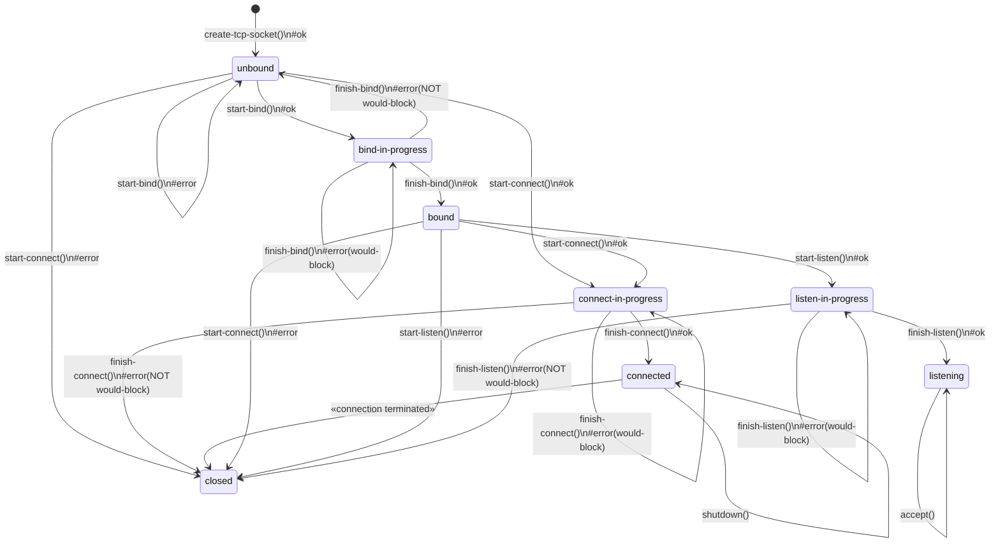

# Operational semantics of WASI TCP sockets

WASI TCP sockets must behave [as-if](https://en.wikipedia.org/wiki/As-if_rule) they are implemented using the state machine described in this document.

## States
> Note: These refer to the states of the TCP socket, not the [TCP connection](https://datatracker.ietf.org/doc/html/rfc9293#name-state-machine-overview)

In pseudo code:

```wit
interface tcp {
    variant state {
        unbound,
        bind-in-progress(bind-future),
        bound,
        listen-in-progress(listen-future),
        listening(accept-stream),
        connect-in-progress(connect-future),
        connected,
        closed,
    }

    type bind-future = future<result<_, error-code>>;
    type listen-future = future<result<_, error-code>>;
    type connect-future = future<result<tuple<input-stream, output-stream>, error-code>>;
    type accept-stream = stream<result<tuple<tcp-socket, input-stream, output-stream>, error-code>>;
}
```

## Pollable readiness
As seen above, there can be at most one asynchronous operation in progress at any time. The socket's pollable ready state can therefore be unambiguously derived as follows:

```rs
fn ready() -> bool {
    match state {
        unbound => true,
        bound => true,
        connected => true, // To poll for I/O readiness, subscribe to the input and output streams.
        closed => true,

        // Assuming that `f.is-resolved` returns true when the
        // future has completed, either successfully or with failure.
        bind-in-progress(f) => f.is-resolved,
        listen-in-progress(f) => f.is-resolved,
        connect-in-progress(f) => f.is-resolved,
        
        // Assuming that `s.has-pending-items` returns true when
        // there is an item ready to be read from the stream.
        listening(s) => s.has-pending-items,
    }
}
```

## Transitions
The following diagram describes the exhaustive set of all possible state transitions:



Most transitions are dependent on the result of the method. Legend:
- `#ok`: this transition only applies when the method returns successfully.
- `#error`: this transition only applies when the method returns a failure.
- `#error(would-block)`: this transition only applies when the method returns the `would-block` error specifically.
- `#error(NOT would-block)`: this transition only applies when the method returns an error other than `would-block`.
- _(no annotation)_: Transition in unconditional.

#### Not shown in the diagram:
- All state transitions shown above are driven by the caller and occur synchronously during the method invocations. There's one exception: the `«connection terminated»` transition from `connected` to `closed`. This can happen when: the peer closed the connection, a network failure occurred, the connection timed out, etc.
- While `shutdown` immediately closes the input and/or output streams associated with the socket, it does not affect the socket's own state as it just _initiates_ a shutdown. Only after the full shutdown sequence has been completed will the `«connection terminated»` transition be activated. (See previous item)
- Calling a method from the wrong state returns `error(invalid-state)` and does not affect the state of the socket. A special case are the `finish-*` methods; those return `error(not-in-progress)` when the socket is not in the corresponding `*-in-progress` state.
- This diagram only includes the methods that impact the socket's state. For an overview of all methods and their required states, see [tcp.wit](./wit/tcp.wit)
- Client sockets returned by `accept()` are in immediately in the `connected` state.
- A socket resource can be dropped in any state.
